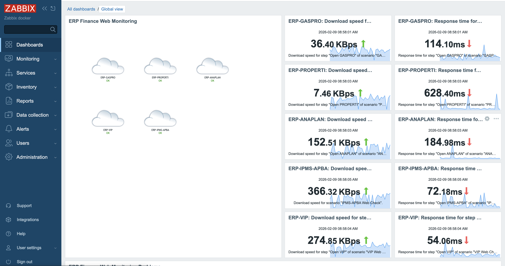
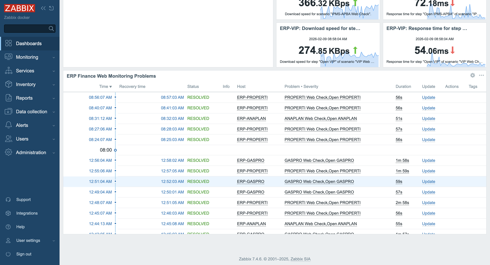

# ERP Finance Monitoring Zabbix

## 📌 Project Overview

This project demonstrates the implementation of an **Enterprise ERP Finance Monitoring System** using **Zabbix** deployed via **Docker**. The monitoring focuses on ensuring availability, performance, and reliability of critical ERP Finance web applications through HTTP checks, triggers, dashboards, and topology visualization.

This project was developed as part of an internship assignment to design and implement a real‑world monitoring solution for enterprise financial systems.

---

## 🖥️ Monitored Applications

The following ERP Finance web applications are monitored:

* **GASPRO** → [https://gaspro.pln.co.id/](https://gaspro.pln.co.id/)
* **PROPERTI** → [https://properti.pln.co.id/](https://properti.pln.co.id/)
* **ANAPLAN** → [https://id1.app.anaplan.com/](https://id1.app.anaplan.com/)
* **VIP** → [https://ipms.pln.co.id/portal](https://ipms.pln.co.id/portal)
* **IPMS‑APBA** → [https://vendorinvoice.pln.co.id/](https://vendorinvoice.pln.co.id/)

---

## ⚙️ Monitoring Method

Monitoring is implemented using **Zabbix Web Scenario (HTTP checks)**.

Each website is monitored using:

* HTTP request availability check
* Response code validation
* Response time measurement
* Download speed monitoring
* Failure detection

---

## 📊 Collected Metrics

Key metrics collected from each monitored web application:

* Response Time
* HTTP Status Code
* Download Speed
* Failed Step Count
* Error Messages
* Availability Status

---

## 🚨 Trigger Configuration

Triggers are configured to detect incidents such as:

### Website Down

```
last(/HOST/web.test.fail[SCENARIO])>0
```

### High Response Time

```
last(/HOST/web.test.time[SCENARIO,STEP,resp])>3
```

### Invalid HTTP Response Code

```
last(/HOST/web.test.rspcode[SCENARIO,STEP])<>200
```

Severity levels:

* High → Website Down / Failure
* Warning → Slow Response

---

## Dashboard Overview



## 🗺️ Topology Map Visualization

A network topology map is created to visualize ERP Finance services.

Features:

* Custom icons per application
* Color indicators:

  * 🟢 Green → Healthy
  * 🔴 Red → Down / Problem
* Real‑time trigger integration

This provides an at‑a‑glance operational status for stakeholders.

---

## 📈 Dashboard Implementation

Custom dashboards include widgets such as:

* Response Time Graph
* Response Code Status
* Download Speed Graph
* Problem Widget
* Availability Overview

These dashboards allow real‑time monitoring and incident detection.

---

## 🐳 Deployment Architecture

Zabbix is deployed using Docker containers:

* Zabbix Server
* Zabbix Web (Nginx + PHP)
* MySQL Database

All services are orchestrated using **Docker Compose**.

---

## 📂 Project Structure

```
ERPFinanceZabbixMonitoring/
│
├── docker-compose.yml
├── README.md
```

---

## 🚀 How to Run

### 1️⃣ Clone Repository

```bash
git clone https://github.com/SaputraAditiya/ERPFinanceZabbixMonitoring.git
cd ERPFinanceZabbixMonitoring
```

### 2️⃣ Start Zabbix Stack

```bash
docker compose up -d
```

### 3️⃣ Access Zabbix Web

```
http://localhost:8080
```

Default login:

* Username: Admin
* Password: zabbix

---

## 🧠 Learning Outcomes

Through this project, the following skills were developed:

* Infrastructure Monitoring Design
* Zabbix Web Scenario Configuration
* Trigger & Alert Management
* Docker‑based Deployment
* Monitoring Dashboard Visualization
* Incident Detection Strategy
* Enterprise System Observability

---

## 🔮 Future Improvements

Potential enhancements:

* Email / Telegram alert integration
* SSL certificate monitoring
* API endpoint monitoring
* Infrastructure (CPU, RAM, Disk) monitoring
* Grafana visualization integration
* CI/CD monitoring automation

---

## 🏷️ Tech Stack

* Zabbix
* Docker
* Docker Compose
* MySQL
* Linux
* HTTP Monitoring

---

## 👨‍💻 Author

**Aditiya Saputra**
ERP Finance Monitoring Implementation Project
DevOps & Monitoring Enthusiast

---

## 📌 Portfolio Note

This repository represents a proof‑of‑concept enterprise monitoring implementation designed for ERP Finance systems to ensure service reliability, performance tracking, and operational visibility.
